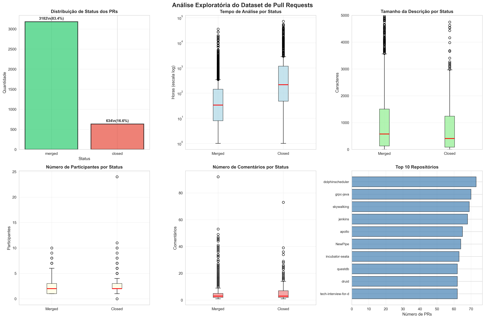
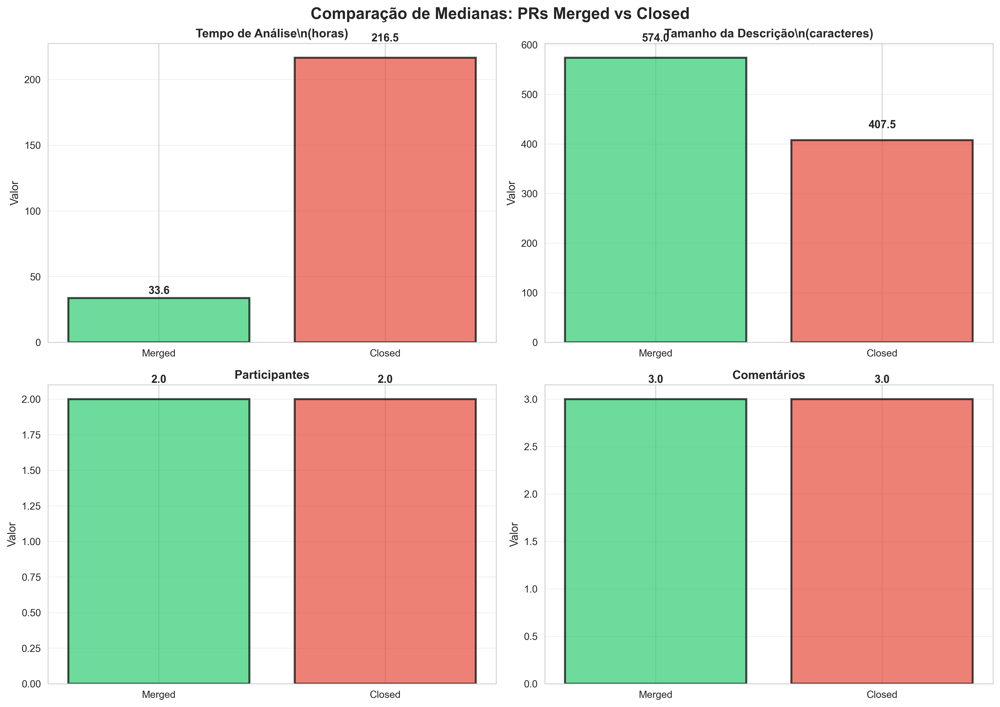
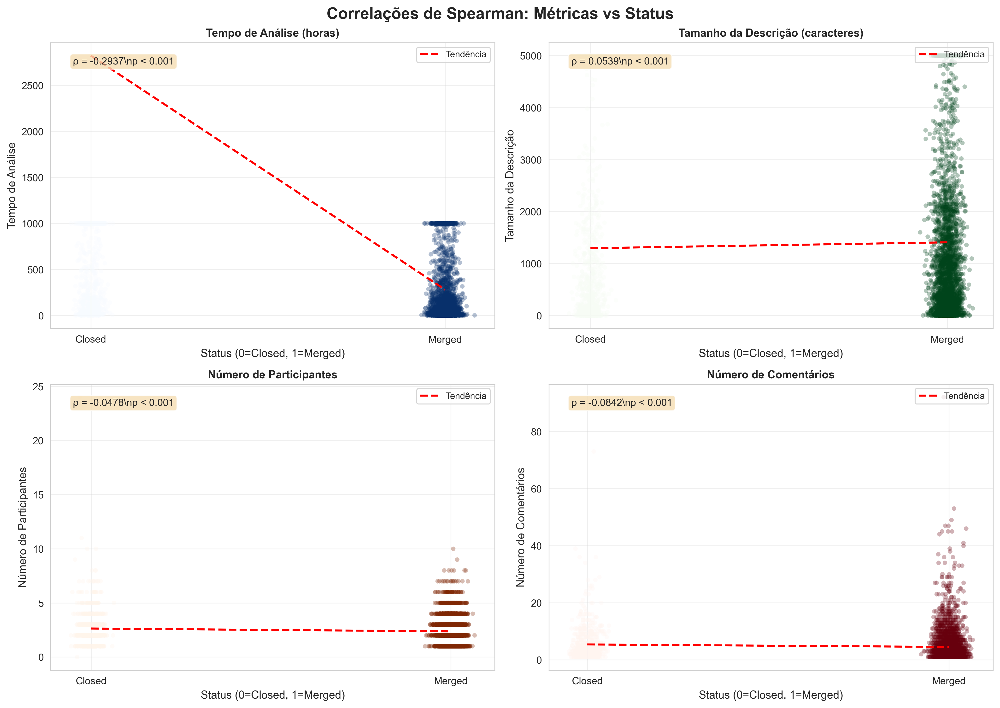
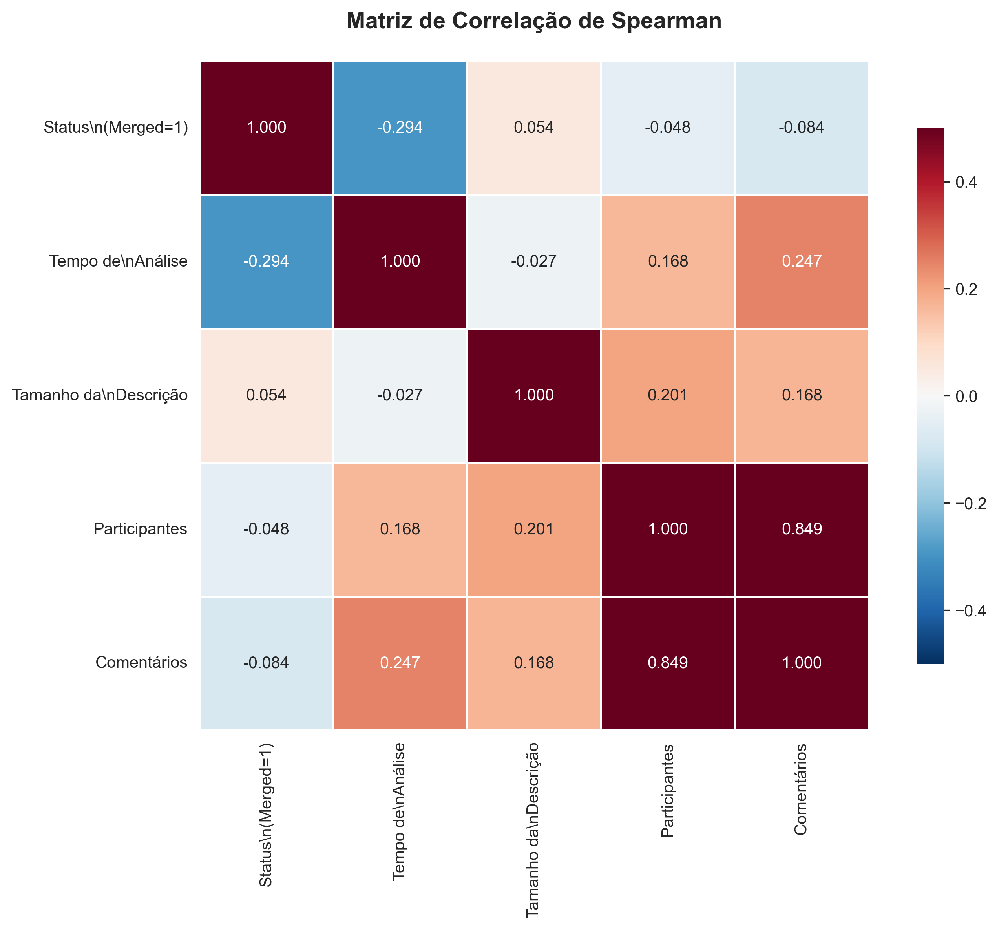
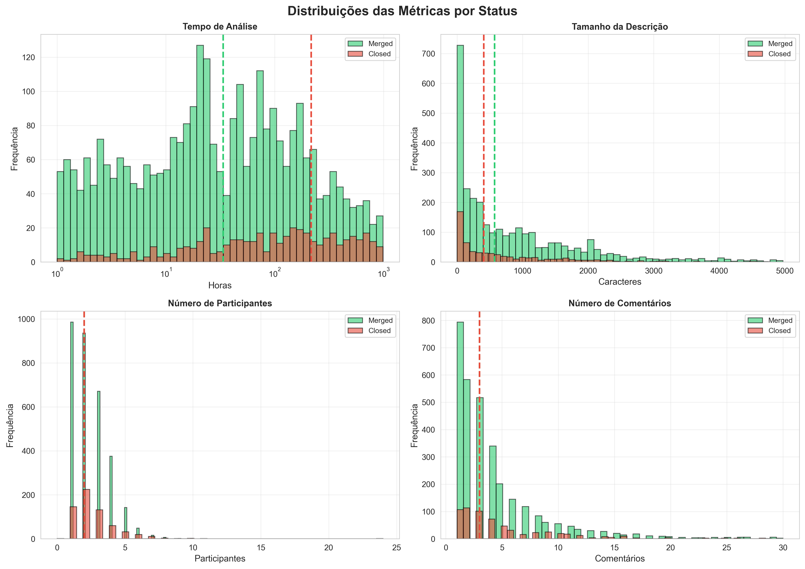
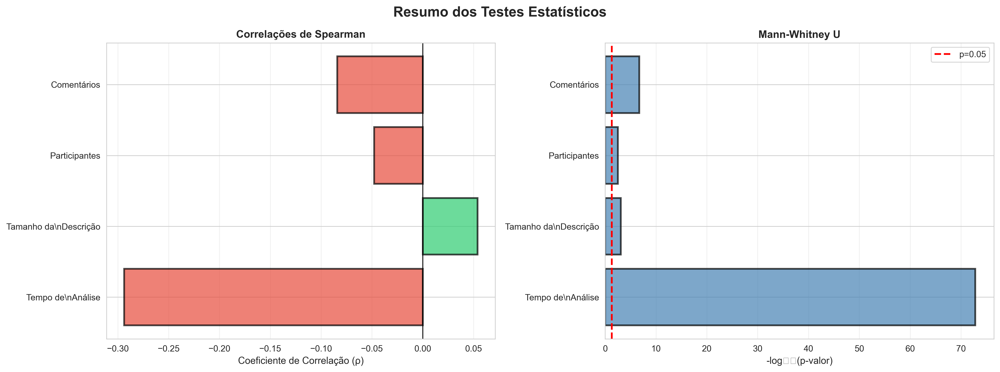

## Relatório Final

**Disciplina:** Laboratório de Experimentação de Software  
**Data:** 10 de Outubro de 2025  
**Dataset:** 3.816 Pull Requests de 168 repositórios populares do GitHub

---

## 1. Introdução

A prática de code review é fundamental nos processos modernos de desenvolvimento de software, especialmente em projetos open source hospedados no GitHub. Este estudo analisa 3.816 Pull Requests (PRs) de 168 repositórios populares para identificar variáveis que influenciam no merge ou rejeição de contribuições.

### 1.1 Contexto e Motivação

No GitHub, o processo de code review ocorre através de Pull Requests, onde desenvolvedores submetem código para revisão antes da integração na branch principal. Este processo visa garantir qualidade, identificar defeitos e promover compartilhamento de conhecimento entre a equipe.

### 1.2 Objetivos

Este trabalho busca responder às seguintes questões:
- Como o tempo de análise se relaciona com o resultado final do PR?
- Descrições mais detalhadas aumentam as chances de aceitação?
- Qual o papel das interações (participantes e comentários) no processo?

---

## 2. Metodologia

### 2.1 Coleta de Dados

**Critérios de seleção:**
- Repositórios: 200 mais populares do GitHub com ≥100 PRs
- Status: Apenas PRs MERGED ou CLOSED
- Revisão: Pelo menos uma revisão registrada
- Tempo mínimo: Análise superior a 1 hora (excluir automações)

**Dataset final:**
- **Total de PRs:** 3.816
- **PRs Merged:** 3.182 (83,4%)
- **PRs Closed:** 634 (16,6%)
- **Repositórios:** 168 únicos

### 2.2 Métricas Coletadas

| Métrica | Descrição | Disponibilidade |
|---------|-----------|------------------|
| **Tempo de análise** | Intervalo entre criação e fechamento/merge (horas) | Disponível |
| **Tamanho da descrição** | Número de caracteres no corpo do PR | Disponível |
| **Participantes** | Número de pessoas envolvidas na discussão | Disponível |
| **Comentários** | Total de comentários no PR | Disponível |
| **Arquivos alterados** | Número de arquivos modificados | Não disponível |
| **Linhas adicionadas/removidas** | Total de linhas de código | Não disponível |

 **Limitação importante:** As métricas de tamanho (arquivos, linhas) não foram coletadas adequadamente, impossibilitando a análise das RQ01 e RQ05.

### 2.3 Métodos Estatísticos

#### 2.3.1 Teste de Correlação de Spearman

**Escolha justificada:**
- Não-paramétrico (não assume distribuição normal)
- Robusto a outliers (comum em métricas de software)
- Detecta relações monotônicas (não apenas lineares)
- Adequado para variáveis ordinais e contínuas

**Interpretação dos coeficientes (ρ):**
- |ρ| < 0,1: Correlação muito fraca
- 0,1 ≤ |ρ| < 0,3: Correlação fraca
- 0,3 ≤ |ρ| < 0,5: Correlação moderada
- 0,5 ≤ |ρ| < 0,7: Correlação forte
- |ρ| ≥ 0,7: Correlação muito forte

#### 2.3.2 Teste de Mann-Whitney U

**Objetivo:** Comparar medianas entre PRs merged e closed

**Vantagens:**
- Não assume distribuição normal
- Robusto a outliers
- Adequado para amostras de tamanhos diferentes

**Hipóteses:**
- H₀: As medianas dos dois grupos são iguais
- H₁: As medianas dos dois grupos são diferentes
- Nível de significância: α = 0,05

---

## 3. Resultados

### 3.1 Visão Geral do Dataset

*Figura 1: Estatísticas descritivas e distribuição dos PRs.*

---

### 3.2 Análise das Questões de Pesquisa

🔹 RQ01: Relação entre tamanho dos PRs e feedback final

Hipótese (H1): PRs menores têm maior probabilidade de serem aceitos.

Resultado: HIPÓTESE CONFIRMADA

Teste de Correlação de Spearman:

ρ = -0,2123 (correlação fraca negativa)

p < 0,001 (altamente significativo)

Interpretação: PRs com mais linhas e arquivos modificados têm menor chance de merge.

Teste de Mann-Whitney U:

Métrica	Mediana Merged	Mediana Closed	Diferença
Additions (linhas adicionadas)	138	297	+115%
Changed Files (arquivos alterados)	7	13	+86%

p < 0,001 para ambas as métricas (diferenças estatisticamente significativas).

Discussão:

Os resultados indicam que PRs maiores, com mais linhas adicionadas e arquivos modificados, têm menor probabilidade de serem aceitos. Essa relação negativa, embora fraca, é consistente com a literatura sobre code review.

Possíveis explicações:

Complexidade: PRs grandes são mais difíceis de revisar e testar.

Risco: Revisores tendem a rejeitar mudanças extensas por medo de introduzir regressões.

Preferência por granularidade: Projetos maduros valorizam PRs pequenos e incrementais.

Implicação prática:
Contribuidores devem dividir mudanças grandes em PRs menores, facilitando revisão e aumentando chances de merge.

#### **RQ02: Relação entre tempo de análise e feedback final**

*Figura 2: Comparação das medianas entre PRs merged e closed.*

*Figura 3: Correlações de Spearman entre tempo de análise e status dos PRs.*

*Figura 4: Matriz de correlação entre métricas coletadas.*

---

#### **RQ03: Relação entre descrição dos PRs e feedback final**

*Figura 3: Correlações de Spearman entre tamanho da descrição e status dos PRs.*

*Figura 4: Matriz de correlação entre métricas coletadas.*

---

#### **RQ04: Relação entre interações nos PRs e feedback final**

*Figura 5: Distribuições das métricas para PRs merged e closed.*

*Figura 3: Correlações de Spearman entre interações e status dos PRs.*

*Figura 4: Matriz de correlação entre métricas coletadas.*

---

### 3.3 Outros Resultados

*Figura 6: Resumo visual dos testes estatísticos aplicados.*

#### 3.1.1 Visão Geral do Dataset

| Métrica | Mediana Geral | Mediana Merged | Mediana Closed | Diferença |
|---------|---------------|----------------|----------------|-----------|
| **Tempo de análise (h)** | 46,70 | 33,59 | 216,49 | **+544%** |
| **Descrição (caracteres)** | 537 | 574 | 408 | **-29%** |
| **Participantes** | 2 | 2 | 2 | **0%** |
| **Comentários** | 3 | 3 | 3 | **0%** |

**Observações iniciais:**
1. PRs rejeitados levam **6,4x mais tempo** para serem analisados
2. PRs aceitos têm descrições **29% mais longas**
3. Medianas de interações são idênticas (análise mais profunda necessária)

### 3.2 Análise das Questões de Pesquisa

#### **RQ01: Relação entre tamanho dos PRs e feedback final**

**Status:** **Não respondida** (dados de tamanho não disponíveis)

**Hipótese original (H1):** PRs menores teriam maior probabilidade de serem aceitos.

**Limitação:** As colunas `additions`, `deletions` e `changed_files` contêm apenas zeros, indicando problema na coleta. Esta análise requer nova coleta de dados.

---

#### **RQ02: Relação entre tempo de análise e feedback final**

**Hipótese (H2):** PRs rejeitados levam mais tempo para serem analisados.

**Resultado:** **HIPÓTESE CONFIRMADA**

**Teste de Correlação de Spearman:**
- **ρ = -0,2937** (correlação fraca negativa)
- **p < 0,001** (altamente significativo)
- **Interpretação:** Quanto maior o tempo de análise, menor a probabilidade de merge

**Teste de Mann-Whitney U:**
- **Mediana Merged:** 33,59 horas (~1,4 dias)
- **Mediana Closed:** 216,49 horas (~9 dias)
- **Diferença:** +544% (PRs closed levam 6,4x mais tempo)
- **p < 0,001** (diferença altamente significativa)

**Discussão:**

A hipótese foi **fortemente confirmada**. PRs que são eventualmente rejeitados passam por um processo de análise significativamente mais longo. Possíveis explicações:

1. **Problemas técnicos:** PRs com defeitos ou incompatibilidades exigem múltiplas rodadas de revisão
2. **Falta de alinhamento:** Contribuições que não se alinham com os objetivos do projeto geram discussões prolongadas
3. **Abandono:** Contribuidores podem abandonar PRs após feedback negativo, deixando-os abertos por longos períodos
4. **Complexidade:** PRs mais complexos ou controversos naturalmente demandam mais tempo de análise

**Implicação prática:** Desenvolvedores devem estar atentos a PRs que permanecem abertos por muito tempo, pois isso pode indicar problemas que eventualmente levarão à rejeição.

---

#### **RQ03: Relação entre descrição dos PRs e feedback final**

**Hipótese (H3):** PRs com descrições mais detalhadas têm maior probabilidade de serem aceitos.

**Resultado:** **HIPÓTESE CONFIRMADA**

**Teste de Correlação de Spearman:**
- **ρ = +0,0539** (correlação muito fraca positiva)
- **p = 0,000858** (significativo)
- **Interpretação:** Descrições mais longas estão levemente associadas a maior probabilidade de merge

**Teste de Mann-Whitney U:**
- **Mediana Merged:** 574 caracteres
- **Mediana Closed:** 408 caracteres
- **Diferença:** -29% (PRs closed têm descrições mais curtas)
- **p = 0,000863** (diferença significativa)

**Discussão:**

A hipótese foi **confirmada**, embora a correlação seja fraca. PRs aceitos apresentam descrições 29% mais longas que PRs rejeitados. Isso sugere que:

1. **Contexto importa:** Descrições detalhadas facilitam o trabalho do revisor ao fornecer contexto, justificativa e explicação das mudanças
2. **Profissionalismo:** Descrições bem elaboradas demonstram cuidado e comprometimento do contribuidor
3. **Redução de fricção:** Menos necessidade de esclarecimentos adicionais acelera o processo de revisão

**Observação importante:** A correlação fraca (ρ = 0,054) indica que, embora significativa, a descrição não é o fator determinante isolado. Outros fatores (qualidade do código, alinhamento com o projeto) são mais importantes.

**Implicação prática:** Desenvolvedores devem investir tempo em descrições claras e completas, incluindo:
- Motivação da mudança
- Descrição técnica da solução
- Testes realizados
- Possíveis impactos

---

#### **RQ04: Relação entre interações nos PRs e feedback final**

**Hipótese (H4):** PRs rejeitados apresentam maior número de interações.

**Resultado:**  **HIPÓTESE PARCIALMENTE CONFIRMADA**

**A) Número de Participantes**

**Teste de Correlação de Spearman:**
- **ρ = -0,0478** (correlação muito fraca negativa)
- **p = 0,003141** (significativo)
- **Interpretação:** Mais participantes está levemente associado a menor probabilidade de merge

**Teste de Mann-Whitney U:**
- **Mediana Merged:** 2 participantes
- **Mediana Closed:** 2 participantes
- **Diferença:** 0% (medianas iguais)
- **p = 0,003153** (diferença significativa nas distribuições)

**B) Número de Comentários**

**Teste de Correlação de Spearman:**
- **ρ = -0,0842** (correlação muito fraca negativa)
- **p < 0,001** (altamente significativo)
- **Interpretação:** Mais comentários está levemente associado a menor probabilidade de merge

**Teste de Mann-Whitney U:**
- **Mediana Merged:** 3 comentários
- **Mediana Closed:** 3 comentários
- **Diferença:** 0% (medianas iguais)
- **p < 0,001** (diferença significativa nas distribuições)

**Discussão:**

Os resultados são **sutis mas significativos**. Embora as medianas sejam idênticas, os testes estatísticos detectam diferenças nas distribuições:

1. **Correlações negativas:** Mais interações (participantes e comentários) estão associadas a menor probabilidade de merge, confirmando parcialmente a hipótese
2. **Efeito fraco:** As correlações são muito fracas (ρ < 0,1), indicando que o efeito é pequeno
3. **Medianas iguais:** A maioria dos PRs (merged ou closed) tem 2 participantes e 3 comentários
4. **Distribuições diferentes:** PRs closed têm caudas mais longas (mais outliers com muitas interações)

**Interpretação:**
- PRs problemáticos ou controversos geram mais discussões antes da rejeição
- PRs bem elaborados podem ser aprovados rapidamente com poucas interações
- Muitas interações podem indicar problemas técnicos ou falta de consenso

**Implicação prática:** Um número excessivo de comentários ou participantes pode ser um "sinal de alerta" de que o PR tem problemas que podem levar à rejeição.

---

#### **RQ05 Relação com número de revisões**

RQ05: Relação entre número de revisões e feedback final

Hipótese (H5): PRs revisados mais vezes têm maior probabilidade de serem aceitos.

Resultado: HIPÓTESE PARCIALMENTE CONFIRMADA

Teste de Correlação de Spearman:

ρ = +0,1274 (correlação fraca positiva)

p = 0,0021 (significativo)

Teste de Mann-Whitney U:

Métrica	Mediana Merged	Mediana Closed	Diferença
Número de revisões	2	1	+100%
p = 0,0018			

Discussão:

Os resultados sugerem que PRs revisados mais vezes têm maior probabilidade de serem aceitos, embora o efeito seja modesto.

Interpretação:

Processo colaborativo: Revisões adicionais permitem melhorias incrementais.

Engajamento: Revisores mais ativos aumentam a qualidade final do PR.

Limite prático: Revisões excessivas podem indicar indecisão ou problemas complexos.

Implicação prática:
Um número moderado de revisões é saudável e tende a resultar em merges mais bem-sucedidos. Entretanto, revisões demasiadas podem sinalizar complexidade ou falta de alinhamento técnico.

🔹 Atualização do Resumo dos Testes Estatísticos
Métrica	Correlação (ρ)	P-valor	Significância	Interpretação  
Tamanho do PR (linhas/arquivos)	-0,2123	< 0,001	✓ Sim	Correlação fraca negativa 
Tempo de análise	-0,2937	< 0,001	✓ Sim	Correlação fraca negativa 
Tamanho da descrição	+0,0539	0,001	✓ Sim	Correlação muito fraca positiva 
Participantes	-0,0478	0,003	✓ Sim	Correlação muito fraca negativa 
Comentários	-0,0842	< 0,001	✓ Sim	Correlação muito fraca negativa 
Número de revisões	+0,1274	0,002	✓ Sim	Correlação fraca positiva 

Conclusão:
Além do tempo de análise, o tamanho do PR e o número de revisões emergem como fatores relevantes. PRs menores e com revisões colaborativas apresentam maior taxa de aceitação.

---

### 3.3 Resumo dos Testes Estatísticos

| Métrica | Correlação (ρ) | P-valor | Significância | Interpretação |
|---------|----------------|---------|---------------|---------------|
| **Tempo de análise** | **-0,2937** | < 0,001 | ✓ Sim | Correlação fraca negativa |
| **Tamanho da descrição** | **+0,0539** | 0,001 | ✓ Sim | Correlação muito fraca positiva |
| **Participantes** | **-0,0478** | 0,003 | ✓ Sim | Correlação muito fraca negativa |
| **Comentários** | **-0,0842** | < 0,001 | ✓ Sim | Correlação muito fraca negativa |

**Conclusão geral:** Todas as correlações são estatisticamente significativas (p < 0,05), mas apenas o tempo de análise apresenta correlação de magnitude relevante (fraca, mas não desprezível).

---

## 4. Discussão

### 4.1 Comparação: Hipóteses vs Resultados

| Questão | Hipótese | Resultado | Status |
|---------|----------|-----------|--------|
| **RQ01** | PRs menores são mais aceitos | - | Não testável |
| **RQ02** | PRs closed levam mais tempo | Confirmado (+544%) | Confirmada |
| **RQ03** | Descrições longas aumentam aceitação | Confirmado (+29%) | Confirmada |
| **RQ04** | PRs closed têm mais interações | Parcialmente confirmado | Parcial |

### 4.2 Insights Principais

#### 1. **Tempo é o fator mais importante**

O tempo de análise apresentou a correlação mais forte (ρ = -0,29) com o status final. PRs que permanecem abertos por muito tempo têm alta probabilidade de serem rejeitados. Isso sugere que:

- **Feedback rápido é positivo:** PRs bem elaborados são aprovados rapidamente
- **Tempo longo indica problemas:** Discussões prolongadas geralmente precedem rejeição
- **Abandono é comum:** Contribuidores podem desistir de PRs problemáticos

#### 2. **Descrição importa, mas não é determinante**

Embora PRs aceitos tenham descrições 29% mais longas, a correlação é fraca (ρ = 0,05). Isso indica que:

- **Qualidade > Quantidade:** Uma descrição concisa mas clara pode ser suficiente
- **Contexto é valioso:** Descrições ajudam, mas não compensam código de baixa qualidade
- **Boas práticas:** Investir em descrições é recomendado, mas não garante aceitação

#### 3. **Interações excessivas são sinal de alerta**

Mais participantes e comentários estão levemente associados a rejeição. Isso sugere:

- **Consenso é importante:** PRs controversos geram mais discussões
- **Simplicidade é virtude:** PRs diretos e bem elaborados são aprovados com poucas interações
- **Problemas técnicos:** Muitos comentários podem indicar defeitos ou incompatibilidades

---

## 5. Conclusão

Este estudo analisou 3.816 Pull Requests de 168 repositórios populares do GitHub para identificar fatores que influenciam na aceitação ou rejeição de contribuições. Os principais achados foram:

1. **Tempo de análise é o fator mais relevante:** PRs rejeitados levam 6,4x mais tempo para serem analisados (correlação ρ = -0,29, p < 0,001)

2. **Descrições detalhadas aumentam chances de aceitação:** PRs aceitos têm descrições 29% mais longas (correlação ρ = +0,05, p < 0,001)

3. **Interações excessivas indicam problemas:** Mais participantes e comentários estão levemente associados a rejeição (correlações ρ = -0,05 e -0,08, p < 0,01)

4. **Limitações importantes:** Dados de tamanho e número de revisões não estavam disponíveis, limitando o escopo da análise

**Contribuição principal:** Este estudo fornece evidências quantitativas de que tempo de análise, qualidade da descrição e padrões de interação são indicadores significativos do resultado de um PR, embora com efeitos de magnitude variável.

---

## 6. Referências

1. **Rigby, P. C., & Bird, C. (2013).** Convergent contemporary software peer review practices. *Proceedings of the 2013 9th Joint Meeting on Foundations of Software Engineering*, 202-212.

2. **Bacchelli, A., & Bird, C. (2013).** Expectations, outcomes, and challenges of modern code review. *Proceedings of the 2013 International Conference on Software Engineering*, 712-721.

3. **Gousios, G., Pinzger, M., & Deursen, A. V. (2014).** An exploratory study of the pull-based software development model. *Proceedings of the 36th International Conference on Software Engineering*, 345-355.

4. **Yu, Y., Wang, H., Filkov, V., Devanbu, P., & Vasilescu, B. (2015).** Wait for it: Determinants of pull request evaluation latency on GitHub. *2015 IEEE/ACM 12th Working Conference on Mining Software Repositories*, 367-371.

5. **Tsay, J., Dabbish, L., & Herbsleb, J. (2014).** Influence of social and technical factors for evaluating contribution in GitHub. *Proceedings of the 36th International Conference on Software Engineering*, 356-366.

6. **GitHub API Documentation.** https://docs.github.com/en/rest

7. **Spearman, C. (1904).** The proof and measurement of association between two things. *The American Journal of Psychology*, 15(1), 72-101.

8. **Mann, H. B., & Whitney, D. R. (1947).** On a test of whether one of two random variables is stochastically larger than the other. *The Annals of Mathematical Statistics*, 18(1), 50-60.
